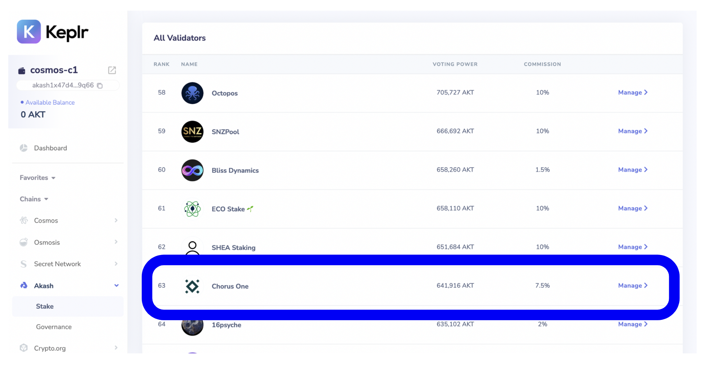

# Akash

## Overview

| Category                         | Details                                                                                 |
| -------------------------------- | --------------------------------------------------------------------------------------- |
| **Chorus One Validator Address** | akashvaloper16pj5gljqnqs0ajxakccfjhu05yczp987ptmjx9                                     |
| **Wallet**                       | Keplr                                                                                   |
| **APR**                          | 40.5                                                                                    |
| **Block Explorer**               | [https://www.mintscan.io/akash](https://www.mintscan.io/akash)                          |
| **Staking Rewards**              | [https://www.stakingrewards.com/earn/akash](https://www.stakingrewards.com/earn/akash/) |
| **Unstaking Period**             | 21 Days                                                                                 |

Akash is a decentralized marketplace, where cloud providers (providers) can lease their computing power to users (tenants). The Akash marketplace functions by conducting reverse auctions whereby the tenant creates orders for computing power, and providers bid on these orders. When the tenant chooses a provider, they create a lease. After this, the user deploys a Docker container on the Akash Container Platform where users are able to then run any cloud-native application and access a range of cloud management services like Kubernetes.


Please note that the unstake period is 21 days. This means that you can only unstake and withdraw coins to your wallet after this time has passed. We wish you profitable staking!


## How to stake

### 1. Install Keplr Wallet Extension

In case you don't have the keplr extension installed in your browser visit [https://www.keplr.app/](https://www.keplr.app) and click on Install extension.&#x20;

 (1) (1) (1) (1) (1) (1) (1).png>)

.png>)

Click on `Install Keplr for Chrome` if you are using a Chrome browser or `Brave` if you are using the Brave browser and follow the installation instructions.

### 2. Create/Import Account

Click on the extension in the Chrome/Brave toolbar and the following page will open up.

.png>)

In case you do not have an existing Keplr account you can create a new account


You will be shown 12 words as your mnemonic seed. Select`24 words` option for a more secure mnemonic. _Back it up securely (read the warning below)_



**Back up your mnemonic seed securely.**&#x20;

* Anyone with your mnemonic seed can take your assets.&#x20;
* Lost mnemonic seed can't be recovered.


Enter an account name and a passphrase to unlock your wallet. You will be asked for the mnemonic again. Enter the 24 words in order. This is to make sure you remember the mnemonic.

 (1) (1) (1) (1).png>)\`

Finally, click on `Next` to create your account

 (1) (1) (1) (1) (1).png>)

### 3. Log in to your account

Regardless of whether you already have an account or if you created it just now you may now click on the extension to view your address or visit [https://wallet.keplr.app/#/akashnet/stake](https://wallet.keplr.app/#/akashnet/stake) to see the full dashboard

 (1) (1) (1).png>)

### 4. Stake your `AKT`

If you don't already have `AKT` in your account fund it with some tokens. You may use an exchange to transfer the AKT tokens to your address or get it from someone who already holds those.

To stake click on the Akash network in the left panel and click on `Stake`&#x20;

.png>)

You will be shown a list of validators with whom to stake on the right side. Scroll to **Chorus One** and click on `Manage.`

A modal with Chorus One's description will pop up. Click once on `Delegate` to enter the amount of tokens you want to stake.&#x20;

.png>)

Clicking on Delegate again will take you to `Keplr` wallet for approval. Approve the transaction and you will be able to see your stake.

.png>)


There is a 21-day unbonding process for staked AKTs during which delegator AKTs do not earn rewards and cannot be transferred, exchanged, or spent. AKTs can, however, be slashed during the unbonding period.


### .png>)

### 5. Claiming rewards

After some time you will see rewards getting accumulated in your account. You can simply go to the Keplr extension to claim them.

.png>)
