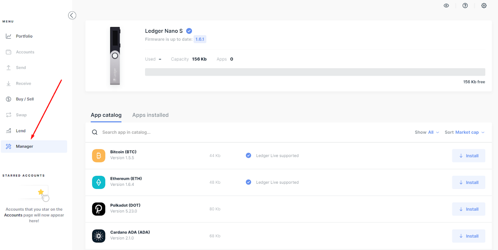

# Band

## Overview

Band Protocol staking can be done through Ledger hardware wallets. When you stake your BAND tokens with Chorus One you can earn rewards up to 11.2% per annum.

| Category                         | Details                                                                                                       |
| -------------------------------- | ------------------------------------------------------------------------------------------------------------- |
| **Chorus One Validator Address** | bandvaloper15urq2dtp9qce4fyc85m6upwm9xul3049fz627w                                                            |
| **APY**                          | 11.2 %                                                                                                        |
| **Wallet**                       | Keplr                                                                                                         |
| **Block Explorer**               | [https://cosmoscan.io/](https://cosmoscan.io) \| [https://www.mintscan.io/band](https://www.mintscan.io/band) |
| **Staking Rewards**              | [https://www.stakingrewards.com/earn/band-protocol/](https://www.stakingrewards.com/earn/band-protocol/)      |
| **Unstaking Period**             | 21 Days                                                                                                       |

The Band Protocol is a platform to aggregate and connect real-world data to smart contracts. Band seeks to deliver trusted information to cross-chain applications via its network of validator nodes.&#x20;

By delegating BAND tokens to a BandChain validator like Chorus One, you are able to earn staking rewards for indirectly participating in securing the network and responding to oracle data requests.\
\
Band oracles are integrated into major blockchains and applications [including Binance Smart Chain, ICON, Nervos, and others](https://medium.com/bandprotocol/partnerships/home).


Please note that the unstake period is 21 days. This means that you can only unstake and withdraw coins to your wallet after this time has passed. We wish you profitable staking!


Please follow the guide below explaining how to stake BAND tokens using a Ledger Nano S/Nano X hardware wallet.

## How to stake

### 1. Launch the Ledger Live app 

### 2. Download Cosmos (ATOM) using Ledger Live 

You will first need to install the Cosmos application (ATOM) from the Ledger Live Directory as the Band Protocol uses Cosmos SDK.

.png>)

### 3. Connect your Ledger device to your web wallet 

Go to the block explorer [website Cosmoscan.io ](http://cosmoscan.io)and click the `Connect` _****_ button in the upper right corner as shown in the image.

.png>)

Now choose a connection method. In our case it’s `Ledger — Cosmos`. Ledger will verify that the site you are connecting the hardware wallet to is genuine. Leave HD Derivation Path unchanged and click `Connect to Ledger`

.png>)

Confirm the action on the[ Cosmoscan.io](http://cosmoscan.io) Band Protocol browser page to use the Ledger device in that browser. Copy the address`chrome://flags/#enable-experimental-web-platform-features` by clicking the `OK` _****_ button in the pop-up window.

.png>)

Then enable the `Experimental Web Platform Features` option.\

.png>)

Restart your browser.

.png>)

Once opened, Cosmoscan.io will ask for permission to connect to the HID device. Click `Connect`.

.png>)

Success! The hardware wallet is successfully connected.

### 4. Top up your wallet 

To get the BAND address, on the main page of the Cosmoscan.io browser, click on the profile icon in the upper right corner, copy the displayed address and send tokens to it.

.png>)

After the coins arrive in the wallet, you can proceed to BAND staking.

### 5. Choose a validator 

You need to select a validator to delegate your BAND tokens. Go to the `Validators` tab (which you saw in the screenshot). Then select a validator from the list, or just start typing its name. We suggest voting for **Chorus One** — a reliable and proven validator present on over 25 networks. We have highly available infrastructure and high uptime (uninterrupted functioning time).

Click on the validator to continue.

### 6. Delegate BAND 

On the page, click `Delegate`.

.png>)

Enter the amount of tokens you want to delegate manually, or just click `Max` to stake the entire amount at once. Usually, you don’t need to enter a Memo, but if the validator has this parameter, then you need to enter it as well. After that click `Next`. \<button>Next\</button>

Click the `Broadcast` _****_ button. A notification will appear on your Ledger device. Confirm the transaction on the device.

If you have successfully staked Band tokens, you will see the following message:

.png>)

Done! After the delegation, by clicking the `View Details` button, you can open a page with detailed information about the transaction.
