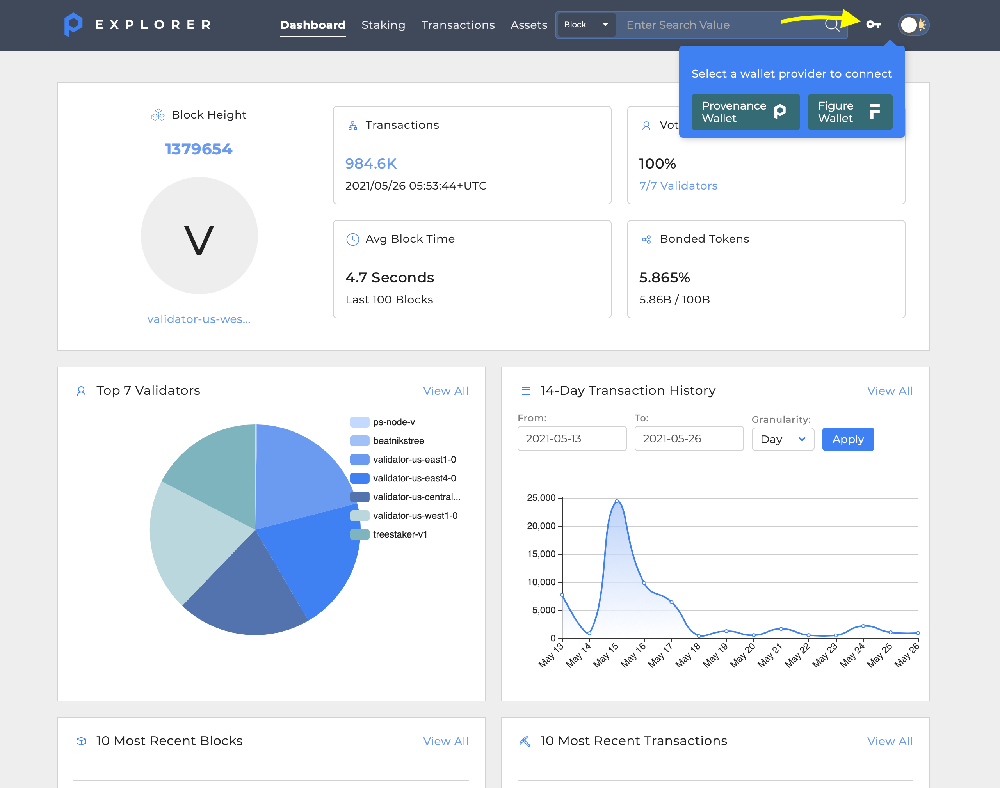
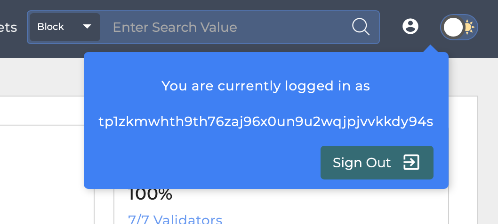
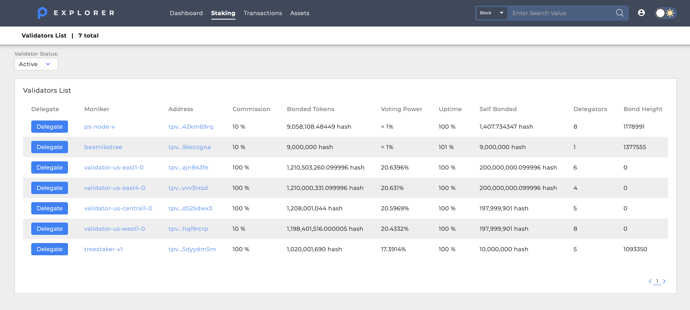
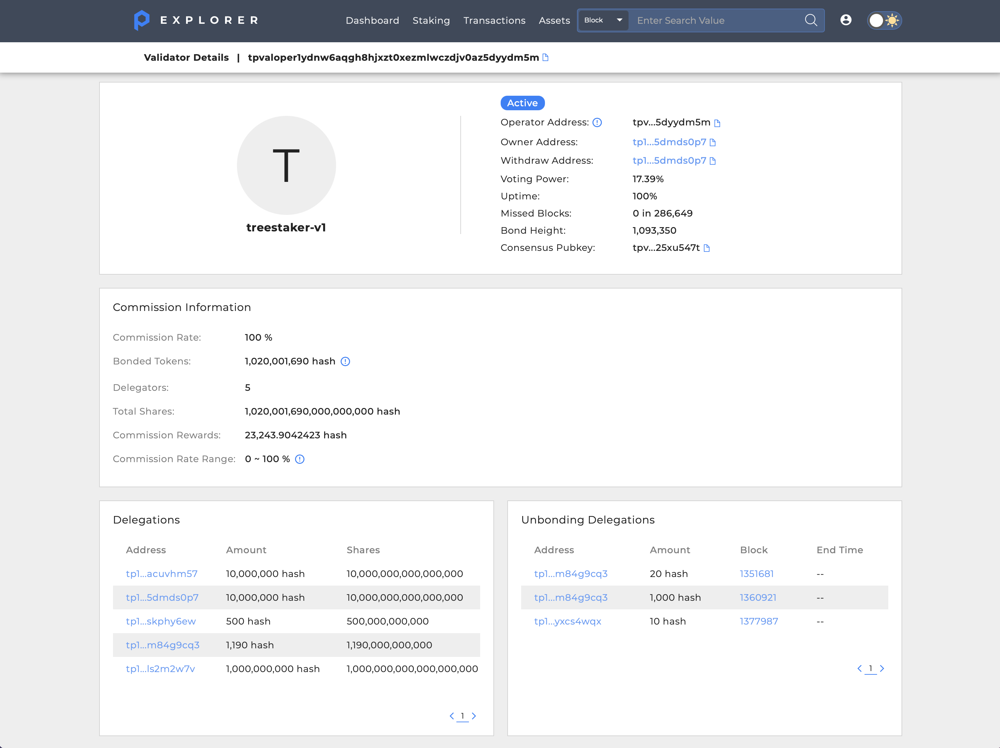
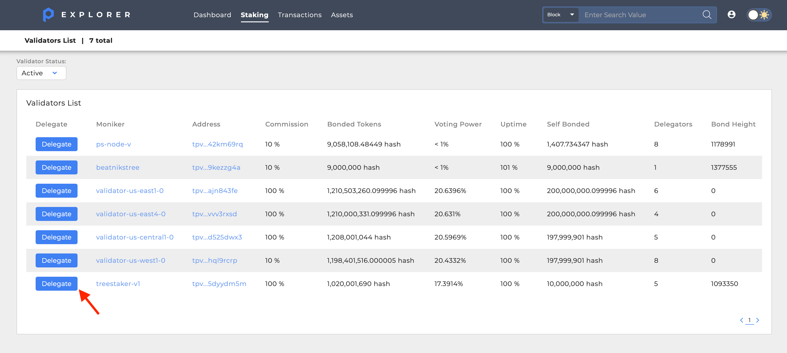
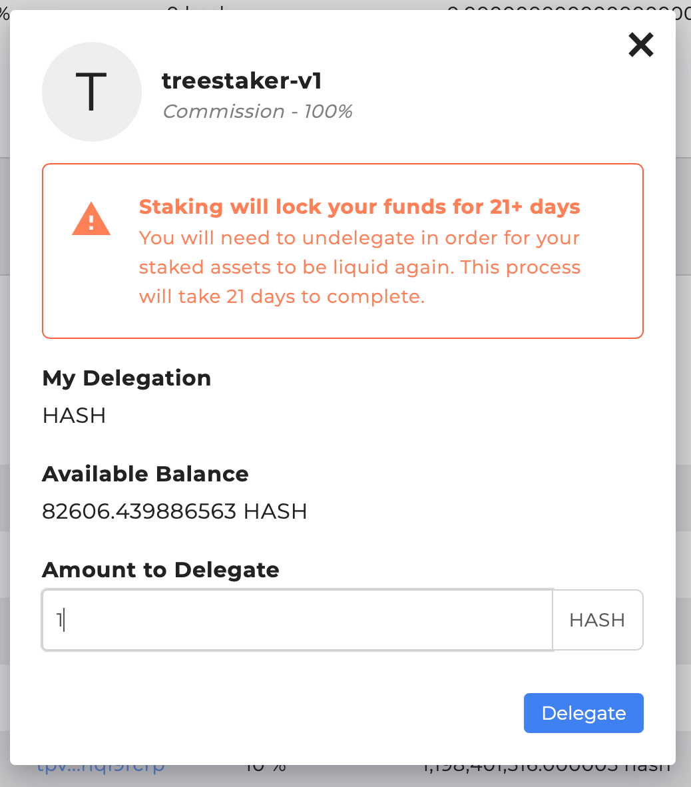
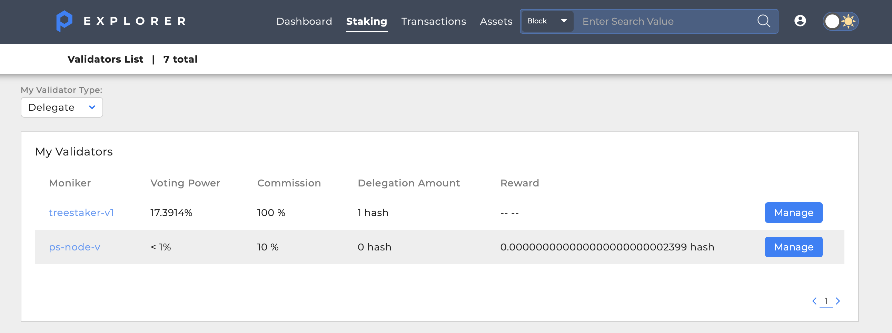
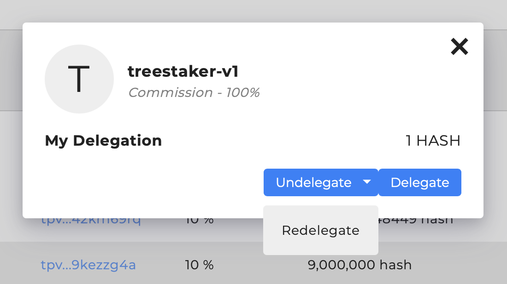

# Provenance

## Overview

| Category                         | Details                                                             |
| -------------------------------- | ------------------------------------------------------------------- |
| **Chorus One Validator Address** | pbvaloper15urq2dtp9qce4fyc85m6upwm9xul30496ze70t (**not live yet**) |
| **Wallet**                       | Provenance Wallet \| Figure Wallet                                  |
| **APR**                          | NA                                                                  |
| **Block Explorer**               | [https://explorer.provenance.io/](https://explorer.provenance.io/)  |

The easiest way to stake your $Hash to a validator is by using the [Provenance Blockchain Explorer.](https://explorer.provenance.io)

## How to stake 

### 1. Connect Your Wallet to Explorer

If you have a Provenance Blockchain or Figure Wallet, navigate to the Provenance Blockchain Explorer and click the "Connect Wallet" key in the upper right-hand corner and select your wallet type:

Once your wallet is connected, the Explorer will show the wallet address is in use and the Key will change to a User profile icon:

### 2. Select validator

With your wallet connected, click the **Staking** menu option to display the list of Validators:

The Validator list shows the Validators that are available to Delegate to. Clicking the `Moniker` or `Address` column for the Validator will show details about the Validator. These details are important when considering a Validator as they demonstrate the Validator's shares, commissions, and delegators:

From the Validator List, click the **Delegate** button next to the Validator you wish to stake with:

### 3. Enter the amount of Hash

Explorer will display important information about the selected Validator and provide an input to enter the amount of Hash you wish to delegate:

### 4. Sign

Once the **Delegate** button is clicked, Explorer will prompt you to sign the transaction with your wallet. Once signed and submitted, the delegation will show in the Provenance Blockchain Validators List:

### How to Manage Your Delegations from Explorer

Once you have delegated Hash to a Validator you can undelegate or redelegate your Hash. When you undelegate, your Hash will not be available for 21 days. You can redelegate to a different Validator at any time.

From the **Staking** menu the My Validators list shows the Validators you have delegated to. Click the **Manage** button to adjust your delegations:


Your rewards for a given validator are immediately claimed when you change your delegation against it, which is reflected in the transaction log.


