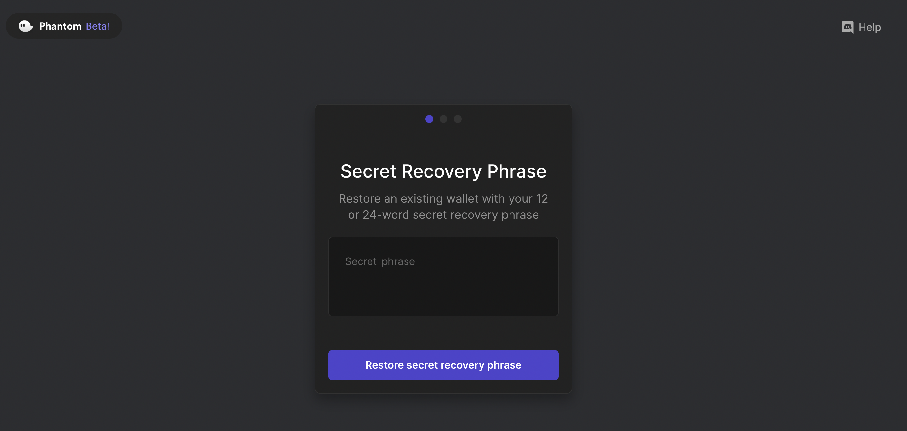
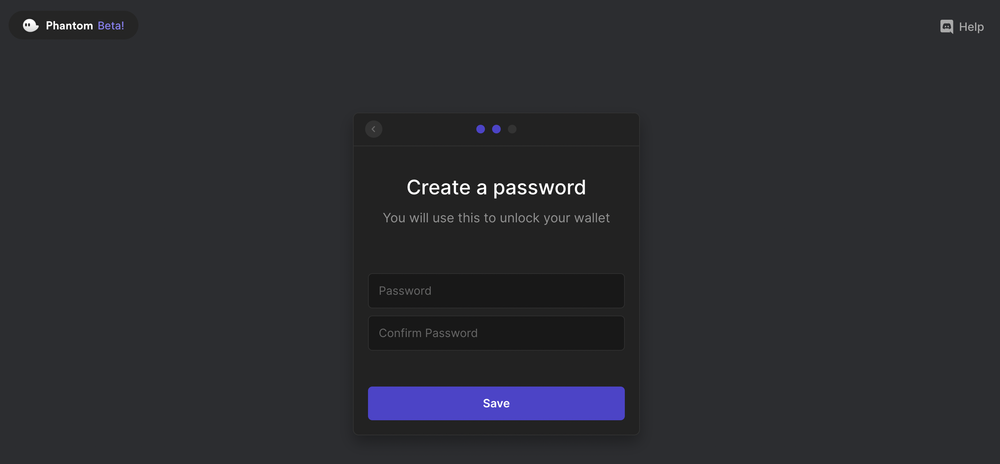
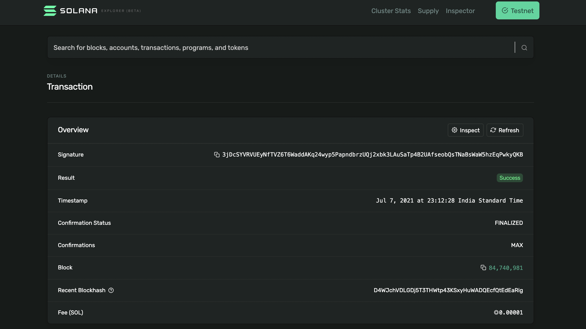

# Solana

## Overview

| Category                         | Details                                                                        |
| -------------------------------- | ------------------------------------------------------------------------------ |
| **Chorus One Validator Address** | Chorus6Kis8tFHA7AowrPMcRJk3LbApHTYpgSNXzY5KE                                   |
| **Wallet**                       | Phantom, Solflare                                                              |
| **APR**                          | 6%                                                                             |
| **Block Explorer**               | [https://solanabeach.io/](https://solanabeach.io)                              |
| **Staking Rewards**              | [stakingrewards.com/earn/solana/](https://www.stakingrewards.com/earn/solana/) |

## How to stake

### 1. Create or Restore Phantom Wallet

Navigate to [https://phantom.app/](https://phantom.app) to create or restore your Solana wallet.

#### Creating the wallet 

If you do not have a wallet yet, you should create a new wallet and note down the seed phrase and store it in a safe place. Follow the onscreen instructions and make sure to fund your wallet with some SOL tokens before you proceed with staking


Make sure to not **share** or **lose** the secret recovery phrase (mnemonic)


.png>)

#### Restoring the wallet

If you already have a wallet, you can restore it on Phantom using the associated seed phrase. Follow the online instructions to restore your SOL account.

Once you entered the 12 or 24 words you can then restore your wallet and optionally set a password on your account.

### 2. Log In

Once you have funded your Phantom wallet with Solana, you can click on the Phantom extension to see your account details.

.png>)

### 3. Stake

Once logged in, you will be able to view all the SPL assets that you possess. If you do not already have SOL tokens you can get them from a friend or buy them off-exchange and transfer those to your wallet.

Once you do that you will be able to see the SOL tokens in your wallet.&#x20;

.png>)

Go ahead and click your SOL balance and on the top right, you will see 3 dots. Click the dots to reveal the staking menu. Click the menu-item `Stake SOL`

.png>)

You will be shown a list of validators along with a search button. Go ahead and type `Chorus One` in the search panel. **Chorus One's** validator will show up. Go ahead and click on the validator name.

.png>)

Choose the amount of SOL you would like to stake and click on `Stake`


Make sure to leave some SOL in your account to pay for the transaction fees


.png>).png>)

Once you click `Stake` you will immediately see that your wallet is staking your SOL to your chosen validator. You can also click on the `View Transaction` link to see the status of your transaction in a blockexplorer. If you look at the Confirmations field you can slowly see it increasing from 0 to 32. Once it reaches the MAX number of confirmations your transaction gets added to the blockchain


Make sure to note down the transaction hash or the link provided on the screen. This allows for easier debugging in case of a failed transaction.


After your transaction is successful you can go back to your Phantom wallet, click on the Solana balance, and see your **stake accounts.**&#x20;

> **Congratulations! You are now staking your SOL!**

If you click on your stake accounts you will see that your stake is activating. It takes 1 epoch for your stake to activate. An epoch in Solana lasts for approximately 2-3 days. After this period your stake will show up as active and will start earning rewards.

.png>)

## **How to u**nstake

If you click on your stake balance, you will be given the option to unstake. Unstaking also takes an epoch. Once you click `Unstake` your stake will start **deactivating** and will become fully **inactive** after a maximum of 3 days (1 epoch).

.png>).png>)

After the stake become inactive you can withdraw it back to your Solana account

.png>).png>)

